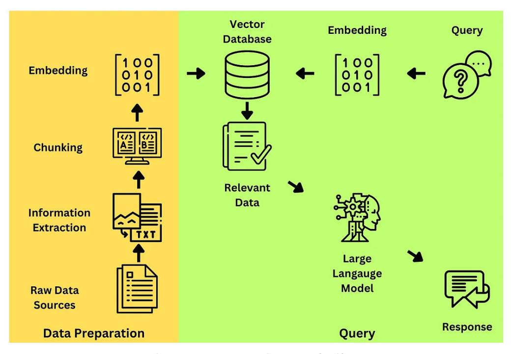

# Retrieval-Augmented Generation (RAG) and Vector Storage

## What is RAG?

**RAG** stands for **Retrieval-Augmented Generation**.  
It’s a technique that combines a **retriever** (to fetch relevant data) with a **generator** (like GPT) to create more accurate and grounded responses.

### Why Use RAG?

LLMs like GPT are powerful, but:
- They have a limited knowledge cutoff.
- They might hallucinate facts.

**RAG solves this** by letting the model pull *real-time relevant documents* before answering.

### RAG Workflow

1. **User asks a question.**
2. The system **retrieves relevant documents** from an external knowledge base.
3. The **retrieved content is passed to the LLM**.
4. The **LLM generates a final response**, grounded in those documents.

### Simple Example

**Without RAG:**

User: "What’s the latest Angular version?"  
GPT: "I’m not sure. My knowledge cutoff is 2023."

**With RAG:**

User: "What’s the latest Angular version?"  
→ System queries Angular docs  
→ Finds: "Angular 19 released in March 2025"  
→ Passes this to GPT  
→ GPT says: "The latest Angular version is 19, released in March 2025."


---

## What is Vector Storage?

Vector storage stores **numerical representations (vectors)** of data — like documents, images, or text — in a way that allows for **fast similarity search**.  
It matches **meanings**, not exact words.

---

## Why Store Vectors?

Text like:
```sh
> "Angular is a frontend framework"
```
...gets converted into a dense vector, e.g.:


Now, when a user asks:
```sh
> “What is Angular used for?”
```
That question is **also embedded into a vector**.  
Vector storage then finds the **most similar vector(s)** — i.e., relevant context — even if the words don’t match exactly.

---

## Vector Storage vs Traditional DB

| Feature                     | Vector DB (e.g. Pinecone, FAISS) | Traditional DB (e.g. MySQL) |
|-----------------------------|----------------------------------|-----------------------------|
| Search by meaning           | ✅ Yes                           | ❌ No                        |
| Exact keyword match         | ❌ No                            | ✅ Yes                       |
| Handles machine learning    | ✅ Yes                           | ❌ No                        |
| Optimized for NLP tasks     | ✅ Yes                           | ❌ No                        |

---

## Popular Vector Storage Tools

- **FAISS** – Open-source, super fast, local.
- **Pinecone** – Cloud-native, managed, scalable.
- **Chroma** – Easy to use, local or hosted.
- **Weaviate** – Comes with built-in transformer integration.
- **Qdrant** – Docker-ready, blazing fast, open-source.

---

## How It Fits in RAG (Retrieval-Augmented Generation)

1. **User query** → Converted into an embedding (vector)
2. **Vector DB** → Searches for semantically similar content
3. **LLM (e.g., GPT)** → Uses that content to generate a grounded response

---

## Summary

Vector storage is how modern AI systems **search by meaning** rather than by exact word match.  
It powers **RAG systems**, **AI document assistants**, **semantic search**, and **recommendation engines**.


## how it works


